# Лабораторная работа 2.1: Динамические соединения с базами данных

**ETL**  

Выполнил: студент группы АДЭУ-221 Дулис Кирилл  

**Вариант №7** – *Скидка: Discount > 0, Анализ по сегментам, Отчет по возвратам*

**Цель работы.**
Получить практические навыки создания сложного ETL-процесса, включающего динамическую загрузку файлов по HTTP, нормализацию базы данных, обработку дубликатов и настройку обработки ошибок с использованием Pentaho Data Integration (PDI).

---

## Шаг 1. Подготовка базы данных

Перед запуском ETL-процесса необходимо создать структуру таблиц в базе данных. Выполнен SQL-скрипт через phpMyAdmin:

**1.1 Таблица заказов**
```
DROP TABLE IF EXISTS orders;
CREATE TABLE orders (
    row_id INT PRIMARY KEY,
    order_date DATE,
    ship_date DATE,
    ship_mode VARCHAR(50),
    sales DECIMAL(10,2),
    quantity INT,
    discount DECIMAL(4,2),
    profit DECIMAL(10,2),
    returned TINYINT(1) DEFAULT 0
);
```

**1.2 Таблица клиентов**
```
DROP TABLE IF EXISTS customers;
CREATE TABLE customers (
    id INT AUTO_INCREMENT PRIMARY KEY,
    customer_id VARCHAR(20) NOT NULL,
    customer_name VARCHAR(100),
    segment VARCHAR(50),
    country VARCHAR(100),
    city VARCHAR(100),
    state VARCHAR(100),
    postal_code VARCHAR(20),
    region VARCHAR(50),
    INDEX idx_customer_id (customer_id),
    INDEX idx_region (region)
);
```
**1.3 Таблица продуктов**
```
DROP TABLE IF EXISTS products;
CREATE TABLE products (
    id INT AUTO_INCREMENT PRIMARY KEY,
    product_id VARCHAR(20) NOT NULL,
    category VARCHAR(50),
    sub_category VARCHAR(50),
    product_name VARCHAR(255),
    person VARCHAR(100),
    INDEX idx_product_id (product_id),
    INDEX idx_category (category),
    INDEX idx_subcategory (sub_category)
);
```
**1.4 Индексы и настройки кодировки**
```
ALTER TABLE orders ADD INDEX idx_order_date (order_date);
ALTER TABLE orders ADD INDEX idx_ship_date (ship_date);

ALTER DATABASE mgpu_ico_etl_07 CHARACTER SET utf8mb4 COLLATE utf8mb4_unicode_ci;
ALTER TABLE orders CONVERT TO CHARACTER SET utf8mb4 COLLATE utf8mb4_unicode_ci;
ALTER TABLE customers CONVERT TO CHARACTER SET utf8mb4 COLLATE utf8mb4_unicode_ci;
ALTER TABLE products CONVERT TO CHARACTER SET utf8mb4 COLLATE utf8mb4_unicode_ci;
```

## Шаг 2. Настройка Job (Главного задания)
---

**Set Variables: Создание пути**
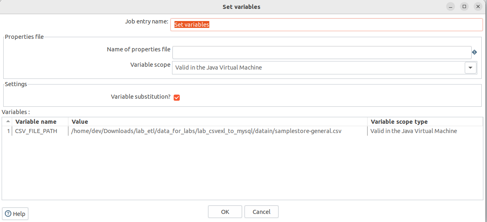


**Check File Exists: Проверка наличия файла ${CSV_FILE_PATH}.**

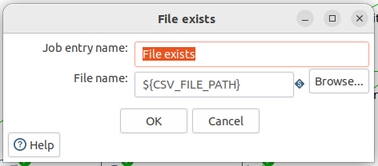

**HTTP (Download): Загрузка файла, если его нет.**
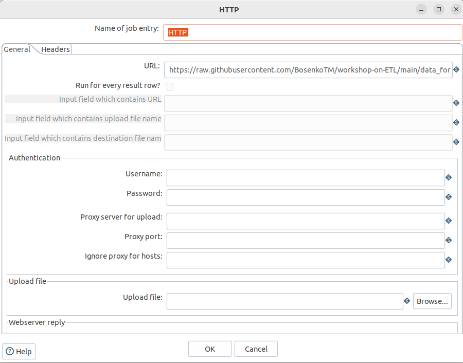

**Трансформация. Вызов трех трансформаций для загрузки данных**
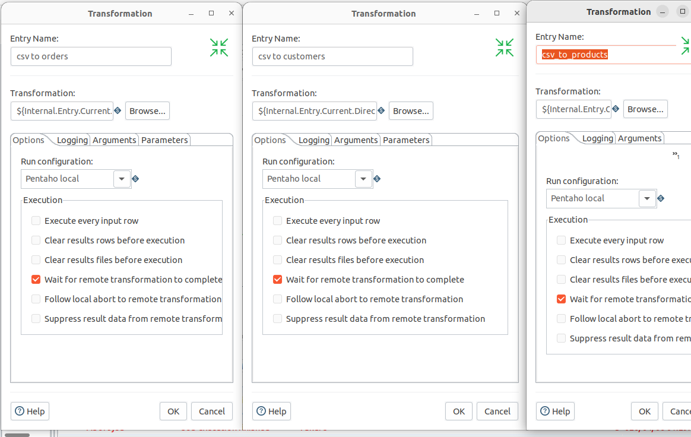

## Шаг 3. Реализация.

### Трансформация 1. Load Orders
**Select Values. Установка типов данных**
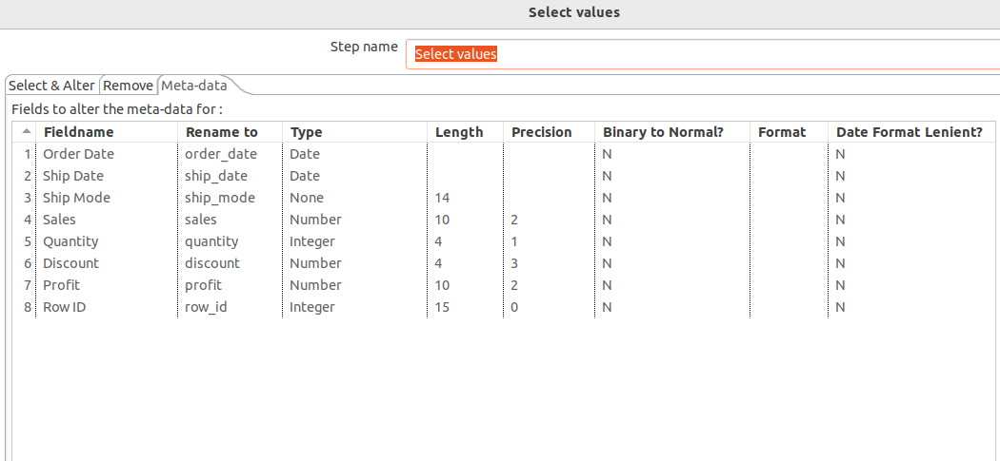

**Filter Rows. Валидация**
Условия:
order_date is not null, ship_date is not null, discount > [0.0]
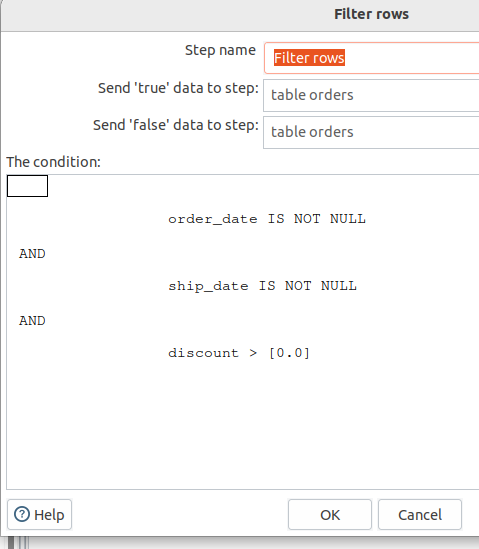

### Трансформация 2. Load Сustomers
**Select Values. Поля, относящиеся к клиенту**
customer_id, city, etc.
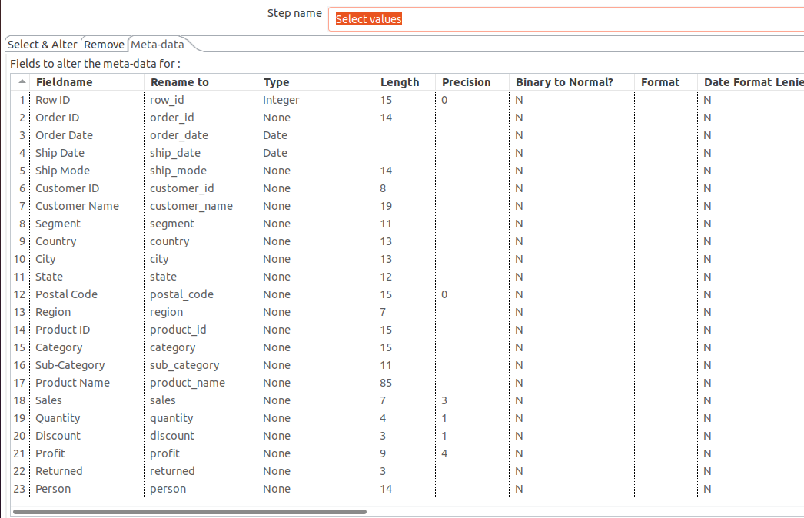


**Memory Group By. Группировка.**

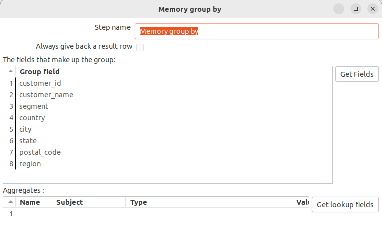

**Table Output. Выгрузка в таблицу.**
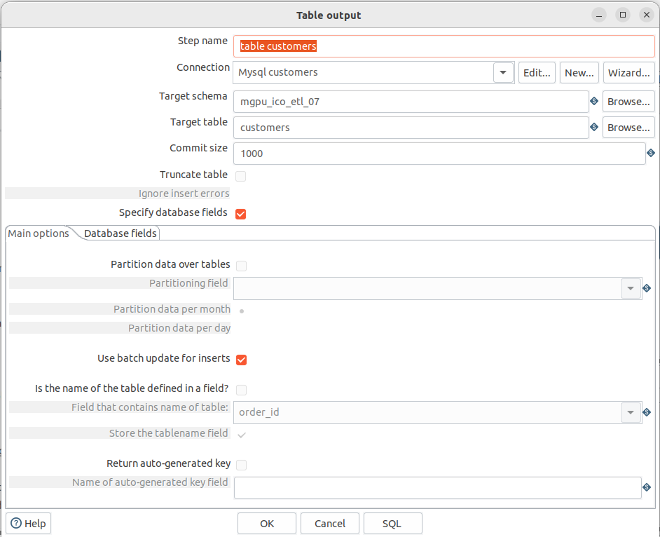

### Трансформация 3. Load Сustomers
**Select Values. Поля, относящиеся к продукту**
product, category, name etc.
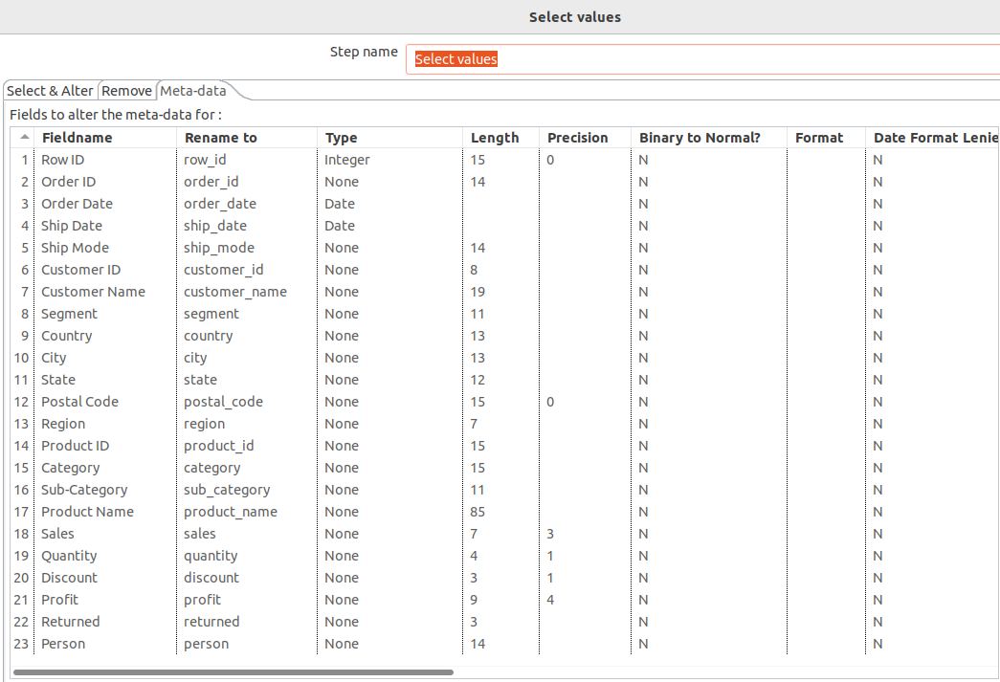


**Memory Group By. Группировка.**

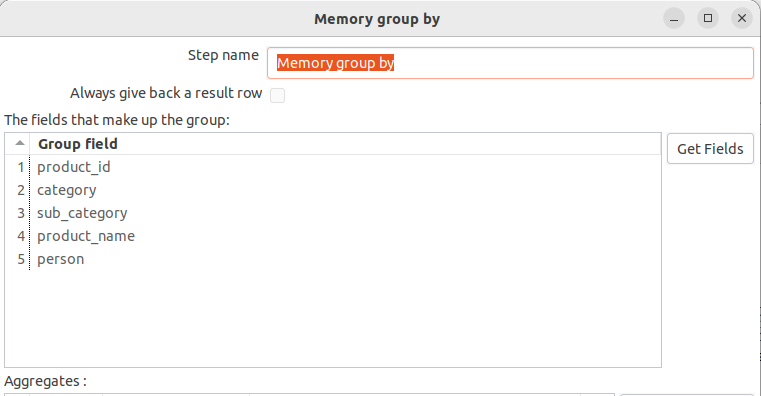

**Table Output. Выгрузка в таблицу.**

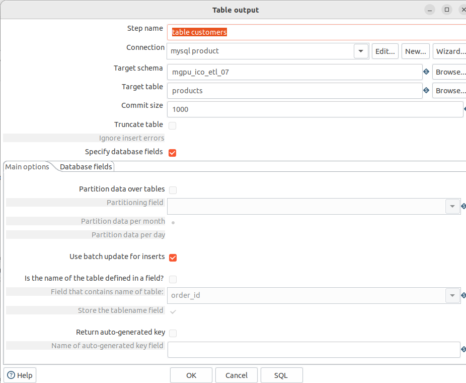

---

## Дополнительные Задания.

**1. Скидка больше 0**

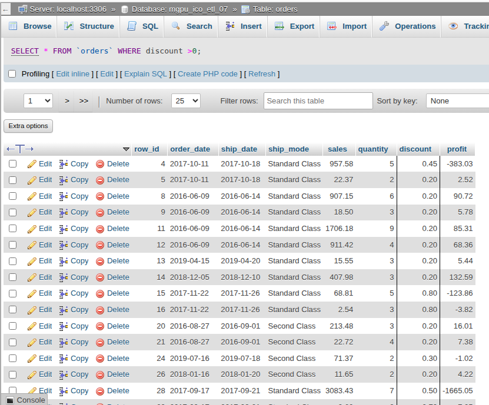

**2. Анализ по скидкам**
   
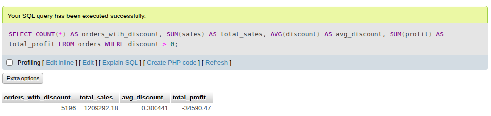

**3. Распределение скидок**
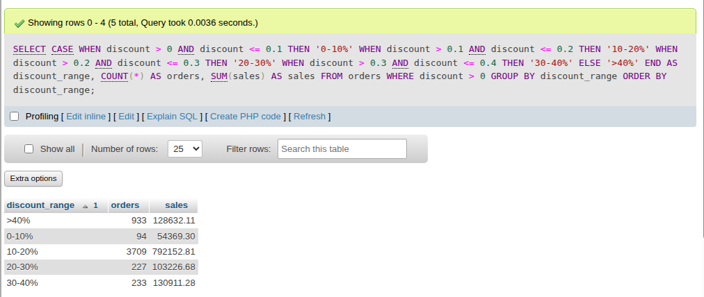

--- 
## Файлы:
[Главный Job (main_etl.kjb)](https://raw.githubusercontent.com/dyx4liss/ETL/main/Job_CSV_to_MYsql.kjb)
*   [Трансформация загрузки клиентов (load_customers.ktr)](https://raw.githubusercontent.com/dyx4liss/ETL/main/lab_02_1_csv_to_Customers.ktr)
*   [Трансформация загрузки продуктов (load_products.ktr)](https://raw.githubusercontent.com/dyx4liss/ETL/main/lab_02_1_csv_to_products.ktr)
*   [Трансформация загрузки заказов (load_orders.ktr)](https://raw.githubusercontent.com/dyx4liss/ETL/main/lab_02_1_csv_orders.ktr)
