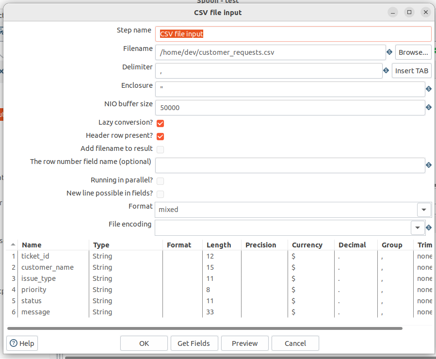

# Лабораторная работа 1.1: Установка и настройка ETL-инструмента. Создание конвейеров данных

**ETL**  

Выполнил: студент группы АДЭУ-221 Дулис Кирилл  

**Вариант №7** – *Клиентский сервис: обработка обращений клиентов*

---

## Описание входных данных

Датасет сгенерирован самостоятельно с помощью Python-скрипта (`generate_customer_data.py`).  
Содержит 100 записей обращений клиентов, из которых ~15% имеют дефекты (пустые поля, неверный формат приоритета, некорректные даты).  

**Поля CSV:**
- `ticket_id` – идентификатор обращения
- `customer_name` – имя клиента
- `issue_type` – тип проблемы
- `priority` – приоритет (low, medium, high, critical + ошибочные варианты)
- `status` – статус обработки
- `message` – текст обращения

---

## Скриншоты созданного конвейера в Spoon (общий вид)


---

## Скриншоты настроек ключевых шагов

### 1. CSV File Input (чтение данных)


### 2. String Operations (очистка пробелов и регистра)


### 3. Filter Rows (отбраковка битых записей)


### 4. Value Mapper (нормализация приоритетов)


### 5. Table Output (загрузка в MySQL)


---

## Изначальная таблица базы данных в phpMyAdmin

Перед запуском ETL таблица `customer_requests` пуста.


---

## Полученная таблица базы данных в phpMyAdmin

После успешного выполнения трансформации в таблицу загружены только очищенные записи (без пустых `ticket_id` и `customer_name`). Приоритеты приведены к единому формату (`Low`, `Medium`, `High`, `Critical`).


---

## SQL-запросы для проверки результата

```sql
-- Общее количество загруженных записей
SELECT COUNT(*) AS total_loaded FROM customer_requests;

-- Распределение приоритетов (должны быть только 4 варианта)
SELECT priority, COUNT(*) FROM customer_requests GROUP BY priority;

-- Проверка отсутствия пустых обязательных полей
SELECT * FROM customer_requests WHERE ticket_id IS NULL OR customer_name IS NULL;
